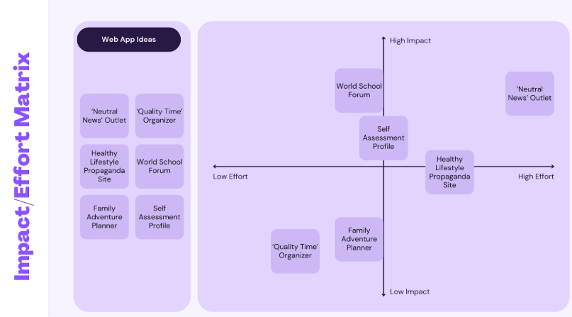
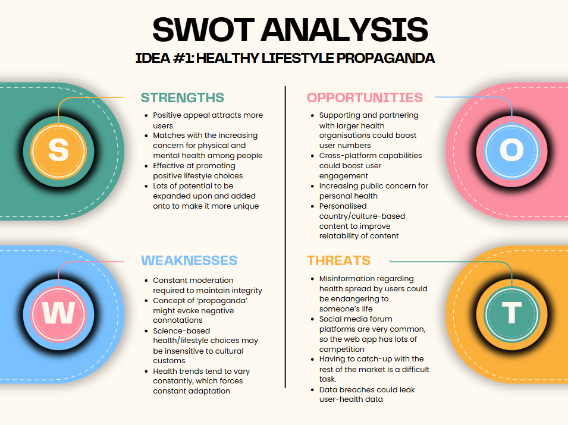
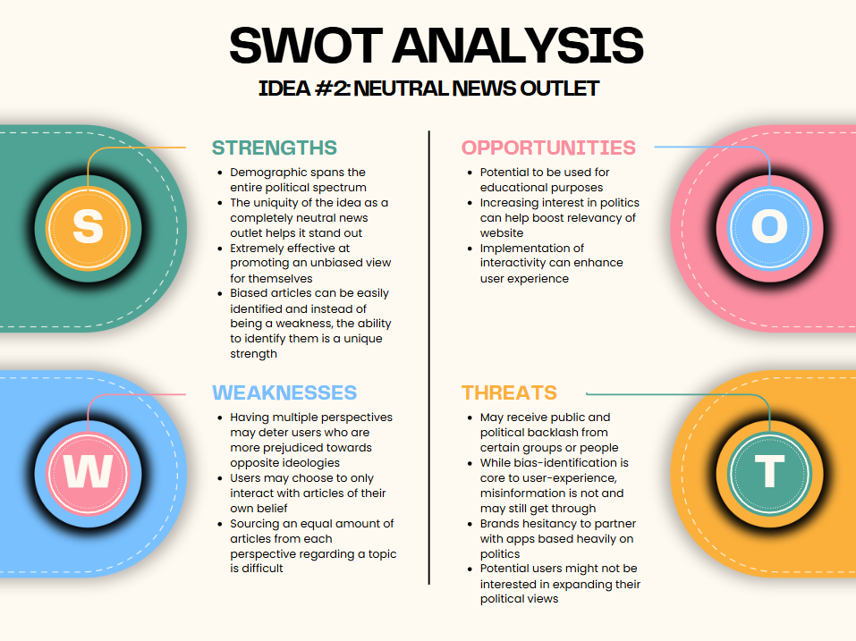
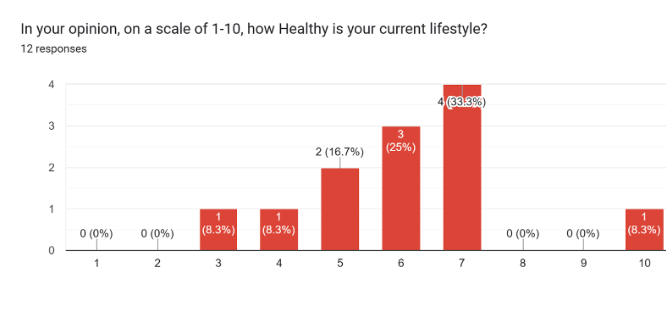
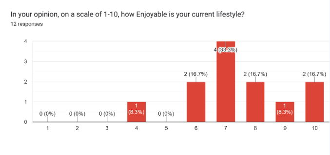
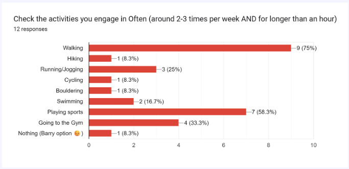
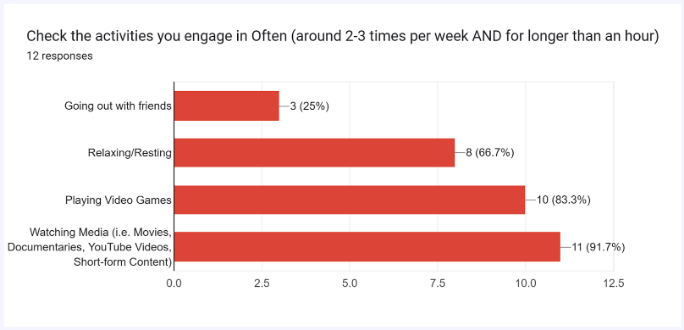
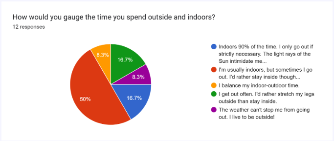
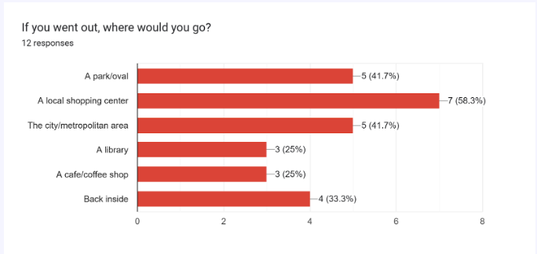
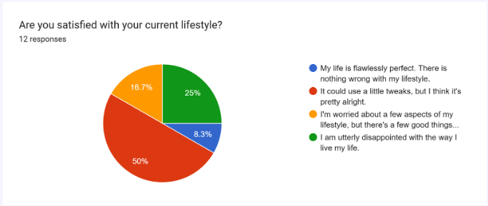

# 10CT200 Assessment Task 2 Portfolio

### Mind Map

---
### 6 Big Ideas
| Idea name | What it does | Influence it explores | Who it helps |
| ----- | ----- | ----- | ----- |
| ‘Neutral News’ Outlet | Shares international news about all topics and from all biases/perspectives. | The influence of targeted media messages and modern news outlet’s tendency to spread more intense stories. | People who are generally uninformed or out-of-the-loop and people who wish to stay properly informed from a neutral perspective. |
| ‘Quality Time’ Organizer | Allows the user to organise how they spend their time with the people they care about. | The pressure from having to maintain the balance between your social life, work life, home life and other inter-personal relations. | Busy people who tend to have many different social groups that they have to keep up with. Forgetful people who tend to forget important dates with other people. |
| Healthy Lifestyle Propaganda | Lets the user spread propaganda about healthy living choices and a balanced lifestyle. | Being addicted to social media and maintaining a social media ‘presence,’ which can distract people from living a balanced lifestyle. | Doomscrollers and people who tend to spend too much time online and on social media. It also gives those with professional knowledge on healthy living a platform to spread their knowledge. |
| World School Forum | Allows anonymous students and teachers to discuss topics about teacher expectations and student behaviour. | A student/employee’s desire to work towards enhancing their skills. The influence of motivation to become better. | Students/employers who wish to develop their skills but are unable to reach out to their teachers/superiors for various reasons |
| Family Adventure Planner | Helps organise family outings and aids in considering all aspects of an enjoyable family trip. | Having to balance your home life, work life and social life and attempting to bridge the hierarchical gap between parents and children | Families with particularly busy schedules who are unable to effectively plan quality outings or families who are simply searching for an easier way to organise their events |
| Self Assessment Profile | Allows the user to take a brief quiz to assess their own character through an unbiased view, to gain a more neutral perspective of themselves | Constantly being compared to other people or comparing yourself to others while also usually downplaying your own strengths or successes | People who struggle with seeing their true self image, either under confident about their own capabilities or overconfident about their own capabilities. |
---

---
### SWOT Analyses/Evaluations

The Healthy Living Propaganda web app possesses a strong appeal to many varying demographics, utilising user input and community engagement to promote a healthy lifestyle. Its strength to positively appeal to potential users and effectively advocate for a healthier lifestyle make it a strong idea, but it has a few weaknesses such as the negative connotations of the word “propaganda,” the risk of misinformation and suppressing cultural customs in favour of scientific facts. Opportunities include partnerships with larger brands and personalised content. Threats include dangerous misinformation being spread on the platform and having to catch up with the rest of the social media market.

The Politically Pluralistic News Outlet allows users to disable their own bias, dismantling echo chambers and showcasing varying ideological perspectives. Its strengths include its mass appeal to the entire political spectrum and identifying biased articles becoming a unique feature, but they are balanced out with weaknesses such as user-prejudice and difficulties in article-sourcing for each political view. Opportunities include its potential to expand into the educational realm and the implementation of more user interactivity, however its weaknesses include misinformation still making its way onto the site and both public and political backlash from certain groups.

---
### Functional/Non-Functional Requirements
**Basic Requirements, as listed in the notification/Gitbook;**  
The web application should clearly respond or relate to the theme of ‘influence,’ aiming to have a positive social impact. It must be interactive in some way and include a clear message or call to action for the user. The app should utilise multimedia elements such as text, images, audio and/or video and be designed with accessibility and user experience in mind.

**Functional Requirements:**

- The user should be able to interact with health ‘propaganda’ within the app by navigating from the front page to the home page, where they can view posts made by other users and interact with those posts.  
  - When the like button is clicked, it should change colour and the like counter should go up by one. This can be self-tested.  
- The user should be able to produce/share health propaganda in the app. They can navigate to the home page, where there will be an option for them to post something new, allowing them to create their own post.  
  - The user types something in the typing field and presses enter, which submits the text to the main page. The typing functionality can be self-tested, while the posting functionality can be peer-tested  
- The user can report a post that they think does not reflect the message of a ‘healthy lifestyle,’ using a button at the bottom of the post that makes the post invisible to the user.  
  - The user clicks the report button, then the post is hidden. This can be self-tested as the report function should only block it for the user who reported it.  
- The user can filter posts by different categories, such as oldest, most popular, specific users, using a drop-down menu on the side of the screen.  
  - When ‘recent’ is selected, the most recent 50 posts should be shown, with the newest at the top of the feed. This can be self-tested.

**Non-Functional** **Requirements:**

- The performance of the app will be smooth as most of the functionality will be contained on one page, allowing for more efficient performance since it won’t have to load different pages all the time.  
- The usability of the app will be basic but efficient, as all the functions will be easy to understand and utilise but contained on the same page.  
- The app will be designed mainly for mobile use, which might influence a smaller aspect ratio on computers but still maintain basic functionality  
- The app will require the user to login to save their post data, so it will need to properly secure and store that information.
---
### Plus, Minus, Implication (PMI) Table
| Example Website | Plus | Minus | Implications |
| ----- | ----- | ----- | ----- |
|  Twitter (now called ‘X’) | Extremely basic premise; online public microblog with messaging capabilities. This limits the need for more complex features to be added. As a global application, it allows for many different cultures, belief systems and religions to interact in a virtual environment. However instead of supporting direct collaboration between different groups, it supports developing general understanding through one-off interactions. | Tweet length is limited to 280 characters. More characters in a tweet is blocked by a subscription. Alternatives such as ‘TwitLonger’ are non-functional. You have to pay to tweet more. ‘X Premium’ is a subscription to Twitter that, among other bonus features, ‘boosts’ a user’s visibility by prioritizing their replies and posts. This directly affects the content that reaches you on Twitter and indirectly suppresses content from those not subscribed to X Premium. | Sticking with a more basic idea for a more streamlined development process both before and after prototype creation. Not indirectly suppressing user engagement and using paid features as an incentive to spend money. Instead encouraging users to donate to separate charities and not-for-profit organisations. |
|  Instagram | Mobile-centric social-networking and media sharing platform that allows users to follow their friends and favourite celebrities, making sharing ideas and content extremely easy and accessible. Lots of different functions for post sharing, allowing users to share a diversity of content to either the public or their followers. | Censorship on Instagram is subpar to non-existent. Content is either inappropriate or outright unsafe for younger audiences. Instagram is owned by Meta, a company infamous for collecting your data, sometimes illegally. In the event of a data breach at Meta, there is an almost guarantee that your data will be in that breach. | Implicating a more mobile-centric layout in my project to boost accessibility among users. Opting not to take sensitive user data without their outright knowledge and whole consent. Implementing adequate censorship to keep the application appropriate. |
|  OceanHero | A free browser extension that dedicates part of its revenue to sustainability efforts concerning plastic bottle waste. It has a counter for how many bottles a user has presumably saved and has a levelling system, adding a level of interactivity to the extension. The browser itself has a very simple and familiar layout, with search result pages resembling that of Google’s. This makes it very easy to use, assuming the user knows how to operate a search engine. | It’s hard to actually confirm whether the gimmick of the engine actually works or makes a difference. The company that owns OceanHero is a for-profit organisation that uses 50% of its revenue from the search engine to fund recycling centers and plastic-bottle collection centers. They work with the companies ‘Trash Waste Solutions’ and ‘Plastic Bank’ to do this but they do not actively address pollution in the actual ocean. There are alternatives to OceanHero that directly address ocean pollution as a whole, such as OCG. | Implicating a more familiar, common and popular layout for my project can help increase appeal and engagement. Better to not be indirect about the causes that my project looks to support, instead opting to be more vocal about addressing social issues directly. Adding more interactive background details that allow the user to track their progress. |
---
### Secondary Research
Health misinformation through propaganda and propaganda adjacent techniques has become a more relevant concern. According to the World Health Organization, the COVID-19 pandemic triggered an “infodemic,” where both accurate and inaccurate health information filled every type of social media platform, with the presence of misinformation undermining the validity of real facts. The World Health Organisation reported that misinformation contributed to the anti-vaccination movement and widespread confusion about public health measures. International news outlet Reuters further reported that the spread of misinformation regarding false cures or solutions spread faster and more widespread than real information, such as Trump’s controversial advice to undergo bleach injections.

Another news outlet, The BMJ highlights that efforts to counter this misinformation often fail, as they disregard the structure of social media ecosystems. It notes that 35 percent of Canadians avoided effective treatments due to false health information, with other countries reporting similar or much worse statistics. Combating incorrect health propaganda requires fact-checking, culturally sensitive communication, improved media literacy and proactive engagement from healthcare professionals.

---
### Primary Research
**Considered Responses:** 12

**Q1:** In your opinion, on a scale of 1-10, how Healthy is your current lifestyle?  
Forms response chart. Question title: In your opinion, on a scale of 1-10, how Healthy is your current lifestyle?. Number of responses: 12 responses.

Mean: 6.08/10  
Median: 6/10  
Mode: 7/10

**Q2:** In your opinion, on a scale of 1-10, how Enjoyable is your current lifestyle?  
Forms response chart. Question title: In your opinion, on a scale of 1-10, how Enjoyable is your current lifestyle?. Number of responses: 12 responses.

Mean: 7.42/10  
Median: 7/10  
Mode: 7/10

**Q3:** Check the activities you engage in Often (around 2-3 times per week AND for longer than an hour) \[PHYSICAL ACTIVITIES\]  
Forms response chart. Question title: Check the activities you engage in Often (around 2-3 times per week AND for longer than an hour). Number of responses: 12 responses.

**Q4**: Check the activities you engage in Often (around 2-3 times per week AND for longer than an hour) \[RECREATIONAL ACTIVITIES\]  
Forms response chart. Question title: Check the activities you engage in Often (around 2-3 times per week AND for longer than an hour). Number of responses: 12 responses.

**Q5:** How would you gauge the time you spend outside and indoors?  
Forms response chart. Question title: How would you gauge the time you spend outside and indoors?. Number of responses: 12 responses.

**Q6:** If you went out, where would you go?  
Forms response chart. Question title: If you went out, where would you go?. Number of responses: 12 responses.

**Q7:** Are you satisfied with your current lifestyle?  
Forms response chart. Question title: Are you satisfied with your current lifestyle?. Number of responses: 12 responses.

**General Observations:**
- General satisfaction with life, as well as personal enjoyment and health, is generally rated above a 5/10, indicating a personal feeling of overall healthiness among people.  
- ‘Going out with friends’ was not a popular activity, however going ‘Back Inside’ was not popular either. This suggests that people are still going out, but interacting with their friends less physically.  
- There is an overlap between people who play sports and people who marked themselves as preferring to stay inside, implying that people are becoming less self-motivated to play sports.
---
### Testing and Evaluating
#### Project Evaluation
* The project was not completed in the end as flask was not able to implemented into the web app to allow it to function as a social media platform. Most of the features relied on the implementation of flask, so most of the features of the website were not able to be implemented. This came mostly down to time constraints, including missing multiple days due to an extended holiday and illnesses. But also the complex nature of flask and failing to get it functioning properly made developing this project especially difficult.
#### Issue Evaluation
* Social concerns surrounding the satirical spread of 'health propaganda' make the project likely somewhat inappropriate or insensitive to real-world issues, with the focus on 'spreading propaganda' putting the ethics of the project into question. However, as it is specified as a satirical type of application, it is legally secure.